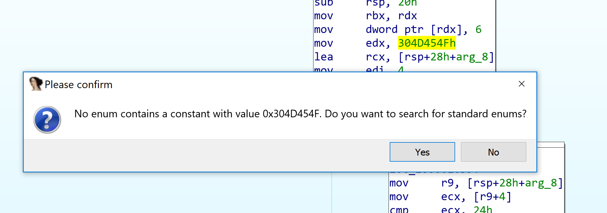
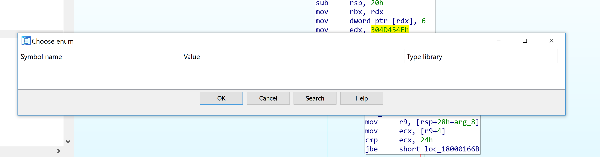
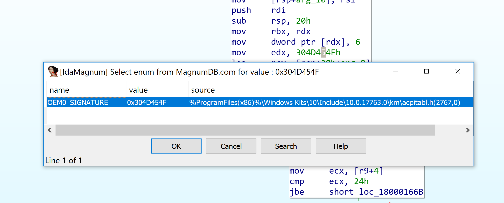
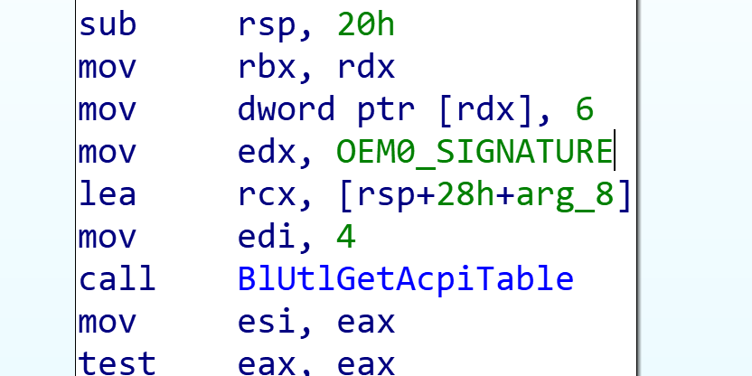

# idamagnum
idamagnum is a plugin for integrating MagnumDB requests within IDA

## Installation

Just drop the single Python file `idamagnum_plugin.py` into IDA's `plugin` directory.

## Usage

IDA is shipped with a pretty limited number of standard enums. Usually, when typing `M` on an unknown enum, the following disappointment happen :

	
	

Fortunately, [a wonderful person](https://twitter.com/smourier) decided to take on the ungrateful task of extracting all "magic" constants from various Microsoft Kits (SDK, WDK, DotNet Core, etc.) and setting up a website to query them : https://magnumdb.com.

Thanks to this plugin, you can now query the MagnumDB by typing `Shift-M` when selecting an unknown constant. A chooser menu should pop up (kinda like `M` shortcut) populated with values from MagnumDB: 

	

Once the enum selected, the plugin automatically tag the constant with the correct name:

	

## Credits

[Simon Mourier](https://twitter.com/smourier)  for creating MagnumDB.com and helping me quering it from IDA.
